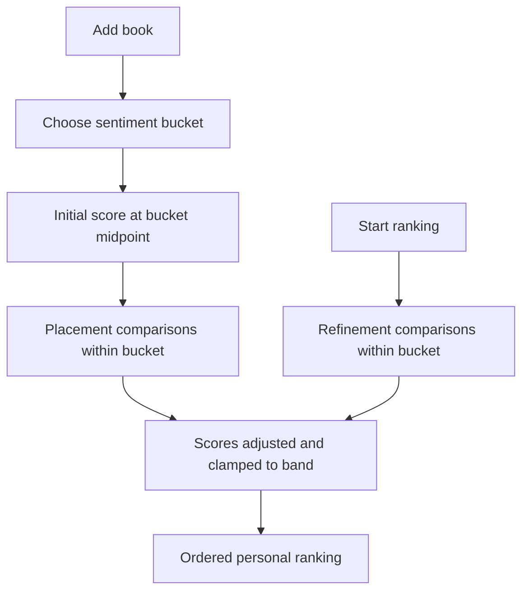

# BookRank — Ranking & data design (MVP)

Implements [decisions.md](./decisions.md): bucketed relative ranking with in-band pairwise comparisons. No application code here—schema and behavior for implementation.

---

## Overview



**User-visible:** rank order, Top 10, Bottom 10.  
**Internal:** numeric `score` in `[1.0, 10.0]` constrained by `bucket`.

---

## Database schema

### `profiles`

| Column | Type | Notes |
|--------|------|--------|
| `id` | `uuid` PK | Same as `auth.users.id` |
| `display_name` | `text` nullable | |
| `created_at` | `timestamptz` | |
| `updated_at` | `timestamptz` | |

### `books` (shared catalog)

| Column | Type | Notes |
|--------|------|--------|
| `id` | `uuid` PK | |
| `title` | `text` NOT NULL | |
| `author` | `text` nullable | Single display string |
| `cover_image_url` | `text` nullable | |
| `isbn_13` | `text` nullable | Unique when present |
| `open_library_key` | `text` nullable | Unique when present |
| `source` | `text` NOT NULL | `open_library` \| `manual` |
| `created_at` | `timestamptz` | |

### `user_books` (library + ranking state)

| Column | Type | Notes |
|--------|------|--------|
| `id` | `uuid` PK | FK target for comparisons |
| `user_id` | `uuid` FK → `profiles.id` | |
| `book_id` | `uuid` FK → `books.id` | |
| `bucket` | `text` NOT NULL | `loved` \| `mid` \| `disliked` |
| `score` | `numeric(4,2)` NOT NULL | Internal order key; clamped to bucket |
| `comparison_count` | `int` NOT NULL DEFAULT 0 | |
| `needs_placement` | `boolean` NOT NULL DEFAULT true | |
| `placement_comparisons_done` | `int` NOT NULL DEFAULT 0 | |
| `date_read` | `date` nullable | |
| `status` | `text` NOT NULL DEFAULT `active` | `active` \| `removed` |
| `created_at` | `timestamptz` | |
| `updated_at` | `timestamptz` | |

**Constraints**

- `UNIQUE (user_id, book_id)`
- `bucket` check: enum values above
- `score` check per row enforced in app/RPC (see bucket ranges below)

**Bucket score ranges (clamp after every update)**

| `bucket` | Min | Max | Initial score |
|----------|-----|-----|-----------------|
| `loved` | 6.50 | 10.00 | 8.25 |
| `mid` | 3.00 | 6.50 | 4.75 |
| `disliked` | 1.00 | 3.00 | 2.00 |

**Indexes**

- `(user_id, status)` — library
- `(user_id, bucket, score DESC)` WHERE `status = 'active'` — in-bucket ranking
- `(user_id, score DESC)` WHERE `status = 'active'` — global ranking list

### `comparisons` (append-only log)

| Column | Type | Notes |
|--------|------|--------|
| `id` | `uuid` PK | |
| `user_id` | `uuid` FK → `profiles.id` | |
| `winner_user_book_id` | `uuid` FK → `user_books.id` | |
| `loser_user_book_id` | `uuid` FK → `user_books.id` | |
| `bucket` | `text` NOT NULL | Denormalized; must match both books’ bucket |
| `context` | `text` NOT NULL | `placement` \| `refinement` |
| `created_at` | `timestamptz` | |

**Constraints**

- Winner ≠ loser
- Trigger or RPC: both `user_books` belong to `user_id`, same `bucket`, both `active`

**Indexes**

- `(user_id, created_at DESC)` — profile stats

### Transaction: `record_comparison`

Single entry point (Supabase RPC recommended):

1. Validate ownership, `active`, same `bucket`.
2. Apply score update (below).
3. Increment `comparison_count` on both rows.
4. Insert `comparisons` row.
5. If placement: increment `placement_comparisons_done` on focus book; evaluate placement complete.

---

## Score update (in-band pairwise step)

Not global Elo. A minimal rule set that stays inside the bucket and preserves strict ordering after each pick.

### Constants

| Constant | Value |
|----------|--------|
| `STEP` | `0.25` | Max movement per book per comparison |
| `MIN_GAP` | `0.01` | Minimum score gap between winner and loser |

### Procedure (winner W, loser L)

1. Let `[min, max]` = bucket range for W and L (same bucket).
2. **Winner:** `W' = min(W.score + STEP, max)`
3. **Loser:** `L' = max(L.score - STEP, min)`
4. If `W' <= L'`, set `mid = (W.score + L.score) / 2`, then:
   - `W' = min(mid + MIN_GAP/2, max)`
   - `L' = max(mid - MIN_GAP/2, min)`
5. If still `W' <= L'`, pin winner at `max` and loser at `min` (only when bucket has room; for identical scores at midpoint, nudge ±`MIN_GAP`).
6. Clamp `W'` and `L'` to `[min, max]`.
7. Persist; require `W' > L'`.

This is intentionally simple: repeated comparisons separate books within the band without exposing math to the user.

### Changing bucket

User selects new bucket → set `bucket`, `score` = new midpoint, `needs_placement = true`, `placement_comparisons_done = 0`. Do not rewrite historical `comparisons`.

---

## Comparison selection

All pair selection uses only **active** books with the **same `bucket`** as the focus (for placement) or the session bucket (for refinement).

### Placement (new or re-bucketed book)

**Focus** = book with `needs_placement = true`.

**Opponents** = other active books in the same bucket, sorted by `score` DESC (tie-break: `comparison_count` DESC, `id`).

| Library in bucket | Behavior |
|-------------------|----------|
| 0 others | `needs_placement = false` immediately |
| 1 other | One comparison vs that book, then complete |
| 2+ others | Binary search on opponent indices |

**Binary search (2+ opponents)**

1. Let `S` = sorted opponent list; interval `[low, high] = [0, |S|-1]`.
2. Pick opponent at `mid = floor((low + high) / 2)`.
3. User picks winner → if focus wins, focus is better than opponent → `low = mid + 1`; else `high = mid - 1`.
4. Re-sort `S` by current `score` after each comparison (scores drift within band).
5. **Stop when** any of:
   - `high - low <= 1` (rank neighborhood found), or
   - `placement_comparisons_done >= ceil(log2(|S|)) + 2`, or
   - user ends session (optional “Done for now” — book stays `needs_placement = true`).

Then set `needs_placement = false`, `placement_comparisons_done = 0`.

### Refinement (“Start ranking”)

1. Choose a **session bucket** (default: bucket with the most `needs_placement` books, else bucket with most active books, else `loved`).
2. For up to **10** rounds, pick pair `(A, B)` in that bucket with highest priority:

| Factor | Points |
|--------|--------|
| Score proximity: `|score_A - score_B| < 0.5` | +40 |
| Either book `comparison_count` below median in bucket | +30 |
| Random 0–5 | tie-break |

3. After 10 comparisons, offer “Continue” (same bucket) or stop.

**MVP:** one bucket per refinement session; user can start another session to refine another bucket.

### Pair presentation

- Randomize left/right on screen only.
- No tie button.
- Repeating the same pair is allowed.

---

## Rankings display

### Global list (rankings page)

```text
ORDER BY score DESC,
         comparison_count DESC,
         created_at ASC
```

Only `status = active`. Bucket clusters appear naturally (Loved books above Mid above Disliked) if scores stay in band.

### Top 10 / Bottom 10

Same query with `LIMIT 10` / `ORDER BY score ASC LIMIT 10` for bottom.

### Library

Sort default: `needs_placement` first, then `score` DESC within bucket groups (optional UX: group by bucket with headers).

---

## Add-book flow

1. Search Open Library or manual create → `books` row (dedupe by `isbn_13` or `open_library_key`).
2. User chooses bucket (Loved / Mid / Disliked).
3. Insert `user_books` with midpoint `score`, `needs_placement = true` (false if first book in that bucket and only book in library — see C5 in decisions).
4. Navigate to **Compare** in **placement** mode for that book.

---

## Profile stats

| Stat | Source |
|------|--------|
| Books read | `COUNT(*)` from `user_books` WHERE `status = 'active'` |
| Comparisons | `COUNT(*)` from `comparisons` WHERE `user_id = ?` |

---

## Edge cases

| Case | Behavior |
|------|----------|
| &lt; 10 active books | Top/Bottom show all |
| Equal scores after update | Tie-break columns on read |
| Remove book | `status = removed`; excluded from pairing |
| Only book in bucket | Skip placement |
| User changes bucket | Midpoint + placement again in new bucket |

---

## What we are not building (MVP)

- Cross-bucket comparisons  
- User-visible scores or “Elo rating”  
- Genre-based bands or stats  
- Comparison session table  
- Star `rating` column on `user_books`

---

## Implementation checklist

- [ ] Migration: tables + RLS + `record_comparison` RPC  
- [ ] Bucket picker on add / edit book  
- [ ] Compare UI: placement vs refinement, same-bucket opponents only  
- [ ] Rankings: ordered list without numeric scores  
- [ ] Update `tech-spec.md` when convenient to say “bucketed relative ranking” instead of “Elo”
